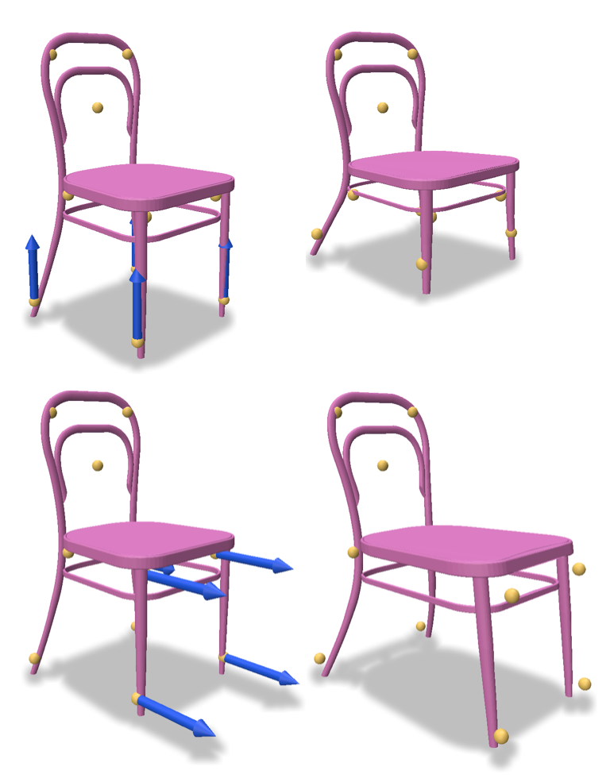

# NeuralMLS - Geometry-Aware Control Point Deformation

We introduce a deformation technique that leverages neural networks to inject the underlying shape geometry into the deformation parameters while introducing desireable biases.

### Eurographics 2022 Short Paper [[Paper]](https://arxiv.org/abs/2201.01873)<br>
by [Meitar Shechter](https://www.linkedin.com/in/meitarshechter/), [Rana Hanocka](https://people.cs.uchicago.edu/~ranahanocka/), [Gal Metzer](https://galmetzer.github.io/), [Raja Giryes](http://web.eng.tau.ac.il/~raja) and [Daniel Cohen-Or](https://danielcohenor.com/).

# Getting Started

### Install
Clone the repo:
```
git clone https://github.com/MeitarShechter/NeuralMLS.git
cd NeuralMLS
```
Install using [conda](https://docs.conda.io/en/latest/):
```
conda env create -f environment.yml
conda activate NeuralMLS
```
Setup python path:
```
export PYTHONPATH=$PYTHONPATH:$(pwd)
```
  
# Running the code

### Training
From the project root directory run:
```
./scripts/run_neuralmls.sh -s <MODEL_PATH>
```
Results will be logged by default into the log directory.

Example on a chair shape:
```
./scripts/run_neuralmls.sh -s "./data/chairs/__chair2/model.obj"
```

### Deforming
From the project root directory run:
```
./scripts/run_neuralmls.sh -s <MODEL_PATH> -c <CHECKPOINT_PATH>
```
Results will be logged by default into the checkpoint directory.

Example on a chair shape:
```
./scripts/run_neuralmls.sh -s "./data/chairs/__chair2/model.obj" -c ./log/main-09-06-2022__14:29:54-NeuralMLS-softmax_temp_1-chair2-rigid/net_final.pt
```

### Reconstructing paper results
We provide scripts which reconstruct various of the paper results and visualizations, flags for playing with those are available in each script.
#### KPD
Some of our scripts relies on a pre-trained model of [Keypoint Deformer](https://tomasjakab.github.io/KeypointDeformer/).
We provide such model for 3 [ShapeNet](https://shapenet.org/) categories (Airplane, Chair, Car) that can be found in "./log/KPD_logs/category_name".<br>

#### Scripts
Comparison to other methods (a KPD pre-trained model must be provided in order to compare to KPD):
```
./scripts/create_comparisons.sh
```

1D weight and deformation visualizations:
```
./scripts/create_1d_illustration.sh
```

2D weight visualization:
```
./scripts/create_2d_illustration.sh
```

User study:
```
./scripts/create_user_study.sh
```

Temperature ablation (controlling interpolation-approximation trade-off):
```
./scripts/create_temperature_illustration.sh
```

Plain MLS ablation (alpha/epsilon):
```
./scripts/run_mls_ablation.sh
```

A visualization of a sequence of defomrations can be created by running the visualization script with the relevant configuration (can be found inside the script):
```
./scripts/create_basic_visualization.sh
```

### Data
We provide several shapes as examples, those are taken from [ShapeNet](https://shapenet.org/).
The human model is by [kaneflame3d](https://www.cgtrader.com/free-3d-models/character/anatomy/realistic-white-male-and-female-low-poly).

# Citation
If you find this code useful, please consider citing our paper
```
@inproceedings {10.2312:egs.20221034,
booktitle = {Eurographics 2022 - Short Papers},
editor = {Pelechano, Nuria and Vanderhaeghe, David},
title = {{NeuralMLS: Geometry-Aware Control Point Deformation}},
author = {Shechter, Meitar and Hanocka, Rana and Metzer, Gal and Giryes, Raja and Cohen-Or, Daniel},
year = {2022},
publisher = {The Eurographics Association},
ISSN = {1017-4656},
ISBN = {978-3-03868-169-4},
DOI = {10.2312/egs.20221034}
}
```

# Questions / Issues
If you have questions or issues running this code, please open an issue.